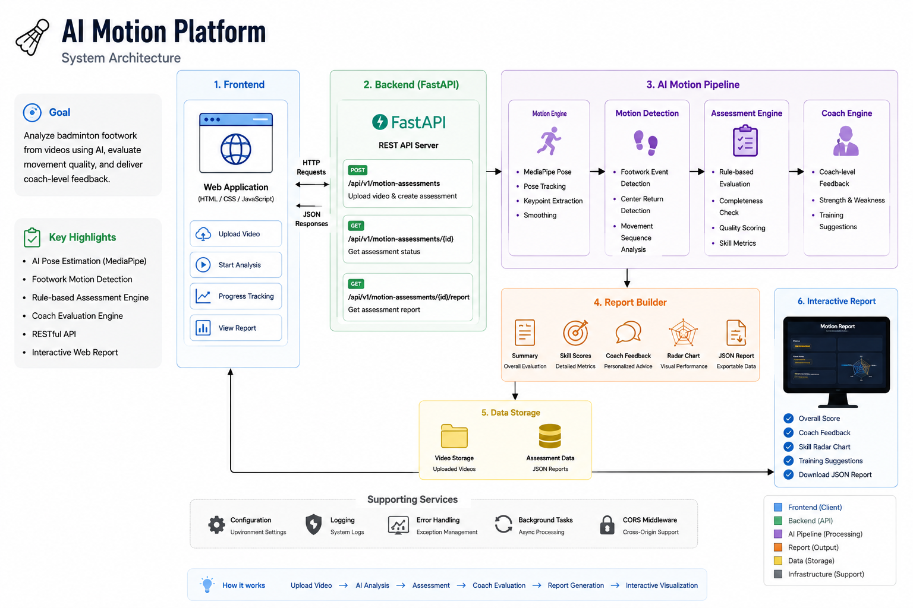

# 🏸 AI Motion Platform

> AI-powered badminton footwork assessment platform built with FastAPI, MediaPipe Pose, and JavaScript.

An end-to-end AI motion analysis platform that detects badminton footwork from video, evaluates movement quality through a rule-based coach engine, and delivers an interactive web report through REST APIs.

---

# Demo

## Home

Upload a badminton video and start AI analysis.

> *(Insert Home Screenshot Here)*

---

## REST API

Interactive Swagger documentation powered by FastAPI.

> *(Insert Swagger Screenshot Here)*

---

## Motion Report

AI Coach evaluation with radar visualization.

> *(Insert Report Screenshot Here)*

---

# Features

- 🎥 Upload badminton videos
- 🤖 AI Pose Estimation (MediaPipe Pose)
- 🏸 Footwork Motion Detection
- 📐 Rule-based Assessment Engine
- 👨‍🏫 Coach Evaluation Engine
- 📊 Interactive Motion Report
- 📡 RESTful API
- 📁 JSON Report Export

---

## Architecture



---

# API

## Create Motion Assessment

```http
POST /api/v1/motion-assessments
```

Upload a badminton video and create a new assessment.

Returns:

```json
{
  "assessment_id": "...",
  "status": "uploaded"
}
```

---

## Get Assessment Status

```http
GET /api/v1/motion-assessments/{assessment_id}
```

Returns

- uploaded
- processing
- completed
- failed

---

## Get Motion Report

```http
GET /api/v1/motion-assessments/{assessment_id}/report
```

Returns

- Motion Summary
- Coach Evaluation
- Skill Scores
- Radar Chart
- Training Suggestions

---

# Tech Stack

| Category | Technology |
|----------|------------|
| Backend | FastAPI |
| AI Vision | MediaPipe Pose |
| Computer Vision | OpenCV |
| Frontend | HTML / CSS / JavaScript |
| Chart | Chart.js |
| Data | JSON |
| Version Control | Git / GitHub |

---

# Project Structure

```text
AI-Motion-Platform
│
├── frontend/
│   ├── index.html
│   ├── report.html
│   ├── css/
│   ├── js/
│   └── assets/
│
├── src/
│
├── tests/
│
├── docs/
│
├── models/
│
├── api_main.py
├── main.py
├── requirements.txt
└── README.md
```

---

# Quick Start

Clone

```bash
git clone https://github.com/nostang/AI-Motion-Platform.git
```

Install

```bash
pip install -r requirements.txt
```

Run Backend

```bash
uvicorn api_main:app --reload
```

Run Frontend

```bash
cd frontend
python -m http.server 8080
```

Open

```
http://127.0.0.1:8080
```

---

# Current Version

**v1.0.0-L3 Release Candidate**

Implemented

- REST API and web frontend
- Pose estimation and footwork event detection
- Motion Feature Library
- Calibration Engine
- Movement Completion assessment
- Recovery Speed assessment
- Direction Coverage review metric
- Body Stability assessment
- Motion Quality assessment
- Explainable Coach feedback and training suggestions
- Stable L3 Summary and Report contract

## Current Assessment Support

- ✅ Footwork Motion Assessment
- ⏳ Serve Assessment — planned after L3 freeze
- ⏳ Clear Assessment — planned after L3 freeze

The current L3 release evaluates general motion quality. Badminton-specific technique rules such as split step, lead foot, and extra-step detection remain L4 work.

---

# Development Roadmap

- **L1 Motion Capture:** complete
- **L2 Motion Engine:** complete
- **L3 Motion Assessment Platform:** release candidate
- **L4 Sport-specific Technique Rules:** planned
- **Future Assessment Modules:** Serve and Clear

Release details: [`RELEASE_L3.md`](RELEASE_L3.md)

---

# License

MIT License

---

# Author

Developed by **Yu-Yin Tang**

AI Motion Platform is an experimental project exploring AI-assisted badminton motion analysis using computer vision and modern web technologies.