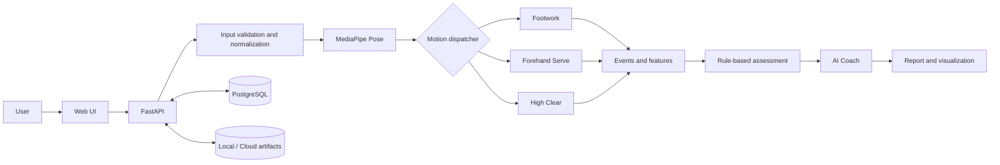

<div align="center">

# 🏸 AI Motion Platform

### Turn badminton video into explainable, coach-ready feedback.

An end-to-end motion assessment platform for badminton training, built with
FastAPI, MediaPipe Pose, OpenCV, PostgreSQL, and vanilla JavaScript.

[](https://www.python.org/)
[](https://fastapi.tiangolo.com/)

[](LICENSE)

**Footwork · Forehand Serve · High Clear**

</div>

> 中文簡介：上傳或錄製羽球動作影片後，系統會擷取人體姿態、辨識動作事件、
> 計算可觀察特徵，最後產生分項評分、動作證據、AI Coach 建議與進步趨勢。

## Overview

Pose landmarks alone do not tell an athlete what to improve. AI Motion Platform
bridges the gap between raw computer-vision output and understandable coaching
feedback:

```text
Video → Pose → Motion Event → Features → Assessment → Coach → Report
```

The scoring path is deterministic and traceable. Each result is connected to
measured evidence and versioned rules; the Coach and Report layers explain the
assessment without silently recalculating it.

| Portfolio snapshot | Current implementation |
|---|---|
| Product scope | Video capture, analysis, feedback, reporting, and progress tracking |
| Motion modules | Footwork, Forehand Serve, High Clear |
| Backend | FastAPI application and REST API v2.6.0 |
| Quality | 216 automated tests plus 18 subtests |
| Delivery | Docker runtime, PostgreSQL repository, optional Google Cloud Storage upload |

## Demo

### 1. Motion selection and video input

Choose a motion, upload or record a video, then isolate one complete movement
within a 30-second analysis window.


### 2. Interactive REST API

FastAPI exposes assessment, annotation, visualization, history, and progress
interfaces through interactive Swagger documentation.


### 3. Explainable motion report

The final report combines dimension scores, confidence, movement evidence,
AI Coach priorities, and a practical training plan.


## What I built

- A browser workflow for video upload, live recording, mobile preprocessing,
  and local segment selection
- A modular motion pipeline that dispatches Footwork, Serve, and Clear videos
  to their own event, feature, assessment, and coaching logic
- Config-driven scoring with explicit schema, engine, calibration, and rule
  versions
- Explainable reports with pose keyframes, motion sequences, and a Footwork
  reach grid
- Human annotation and review flows for action windows and racket-side context
- User-level competency summaries, historical score charts, and comparable
  dimension-level progress
- PostgreSQL persistence, private direct-to-cloud upload support, video
  normalization, and containerized deployment
- A regression suite covering the motion engine, contracts, API behavior,
  frontend behavior, storage, and visual output

## Supported assessments

| Motion | Evaluated dimensions | Explainable output |
|---|---|---|
| Footwork | Movement completion, recovery speed, direction coverage, motion quality, body stability | Dimension evidence, reach grid, coach priorities, training suggestions |
| Forehand Serve | Preparation stability, swing completeness, body coordination, motion smoothness | Stage-aware scoring and targeted coaching feedback |
| High Clear | Sideways preparation, weight transfer, non-racket arm balance, swing smoothness | Preparation/swing/finish keyframes and pose sequence |

## Architecture



### Design decisions

- **Explainability first:** measured evidence and rule IDs remain attached to
  scores and feedback.
- **Clear layer ownership:** Measurement measures, Assessment scores, Coach
  interprets, Report presents, and Validator checks the final contract.
- **Version-safe results:** schemas, engines, calibrations, rules, and reports
  carry independent version metadata.
- **Human-in-the-loop support:** users can confirm an action window and racket
  side when automatic inference is uncertain.
- **Input robustness:** long or mobile-recorded videos can be trimmed and
  normalized before pose analysis.

## Tech stack

| Area | Technology |
|---|---|
| Backend and API | Python 3.13, FastAPI, Uvicorn, Pydantic |
| Computer vision | MediaPipe Pose, OpenCV, NumPy |
| Frontend | Semantic HTML, CSS, vanilla JavaScript, custom SVG visualization |
| Data and storage | PostgreSQL, psycopg, JSON artifacts, Google Cloud Storage |
| Video pipeline | FFmpeg, browser MediaRecorder, MediaPipe Tasks Vision |
| Testing | pytest, FastAPI TestClient, contract and frontend regression tests |
| Delivery | Docker, environment-based configuration, storage lifecycle policy |

## Main API flow

| Method | Endpoint | Purpose |
|---|---|---|
| `POST` | `/api/v1/motion-assessments` | Upload a video and create an assessment |
| `POST` | `/api/v1/motion-assessments/from-storage` | Analyze a private cloud-stored video |
| `GET` | `/api/v1/motion-assessments/{assessment_id}` | Read processing status and progress |
| `GET` | `/api/v1/motion-assessments/{assessment_id}/report` | Read the completed assessment report |
| `GET` | `/api/v1/motion-assessments/{assessment_id}/visualization` | Read explainable pose and movement evidence |
| `GET` | `/api/v1/users/{user_id}/dashboard` | Read the cross-motion competency dashboard |
| `GET` | `/api/v1/users/{user_id}/history-trend` | Read comparable historical score series |

See the [documentation index](docs/README.md),
[API contract](docs/API_CONTRACT_V2.md), and
[web integration guide](docs/web_integration/README.md) for the complete
interface and response contracts.

## Project structure

```text
AI-Motion-Platform/
├── frontend/       Browser UI, responsive styles, and client-side workflows
├── src/
│   ├── api/        HTTP endpoints, services, storage, and repositories
│   ├── motion/     Motion abstractions and analyzers
│   ├── event/      Footwork, Serve, and Clear event detection
│   ├── features/   Observable motion feature extraction
│   ├── assessment/ Rule-based scoring modules
│   ├── coach/      Explainable feedback and training suggestions
│   ├── report/     Stable report and summary builders
│   ├── progress/   Historical comparison logic
│   ├── validator/  Pipeline and contract validation
│   └── visualization/ Pose, keyframe, sequence, and reach-grid output
├── tests/          Unit, API, contract, frontend, and regression tests
├── docs/           Specifications, API contracts, releases, and calibration notes
├── models/         MediaPipe model assets required at runtime
├── dataset/        Versioned metadata; local videos remain untracked
├── scripts/        End-to-end verification scripts
├── tools/          Calibration and shadow-comparison utilities
├── migrations/     PostgreSQL migrations
├── infra/          Cloud storage and deployment configuration
├── api_main.py     FastAPI entry point
└── main.py         Local dataset-analysis entry point
```

## Quick start

### Prerequisites

- Python 3.13
- FFmpeg
- PostgreSQL with the AI Motion application schema

### Installation

```bash
git clone https://github.com/nostang/AI-Motion-Platform.git
cd AI-Motion-Platform

python -m venv .venv
source .venv/bin/activate
pip install -r requirements.txt

cp .env.example .env
# Update DATABASE_URL in .env for your PostgreSQL instance.

uvicorn api_main:app --reload --port 8000
```

Open <http://127.0.0.1:8000>. The same FastAPI process serves the web interface
and REST API. Swagger is available at <http://127.0.0.1:8000/docs>.

For deployment-oriented dependencies, use `requirements.runtime.txt` or the
included `Dockerfile`.

## Testing and validation

```bash
python -m pytest -q
```

Current result:

```text
216 passed, 18 subtests passed
```

The versioned regression set covers Footwork, Forehand Serve, and High Clear.
Large source videos, generated reports, uploads, local databases, `.env` files,
and virtual environments are intentionally excluded from Git.

## Current version

- **Platform release:** v1.3.0-L3
- **REST API:** v2.6.0
- **Status:** Footwork, Forehand Serve, and High Clear pipelines implemented

Release references:

- [v1.3.0-L3 release notes](docs/Release/v1.3.0-L3.md)
- [v1.0.0-L3 freeze contract](docs/Release/v1.0.0-L3.md)
- [Motion specification index](docs/Specification/README.md)

## Roadmap

- [x] L1 — Motion capture and pose extraction
- [x] L2 — Event, feature, and motion engines
- [x] L3 — Assessment, Coach, Report, Validator, and REST API
- [x] Explainable keyframes, reach-grid evidence, and progress comparison
- [ ] Expand multi-video and coach-led calibration
- [ ] Add deeper sport-specific technique rules and confidence evaluation
- [ ] Extend outcome-aware analysis beyond visible body-motion quality

## Limitations

- The current system uses single-camera 2D pose landmarks; it is not a
  professional biomechanics system.
- It evaluates visible movement quality, not shuttle trajectory, shot speed,
  landing position, grip, or official service legality.
- Camera angle, framing, occlusion, and video quality can affect measurements.
- Calibration thresholds remain subject to broader athlete and coach validation.

## License

Licensed under the [MIT License](LICENSE).

## Author

Designed and developed by **Yu-Yin Tang**
([@nostang](https://github.com/nostang)).

This project demonstrates product thinking, computer-vision integration,
backend architecture, explainable rule design, frontend visualization, and
contract-driven testing in one end-to-end system.
