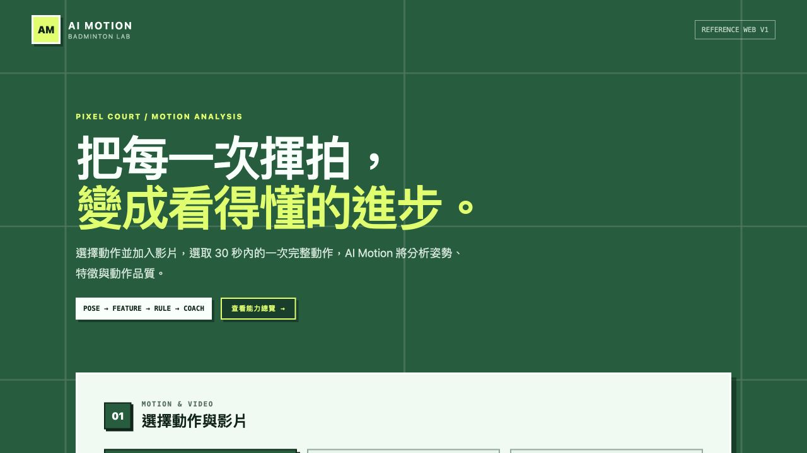
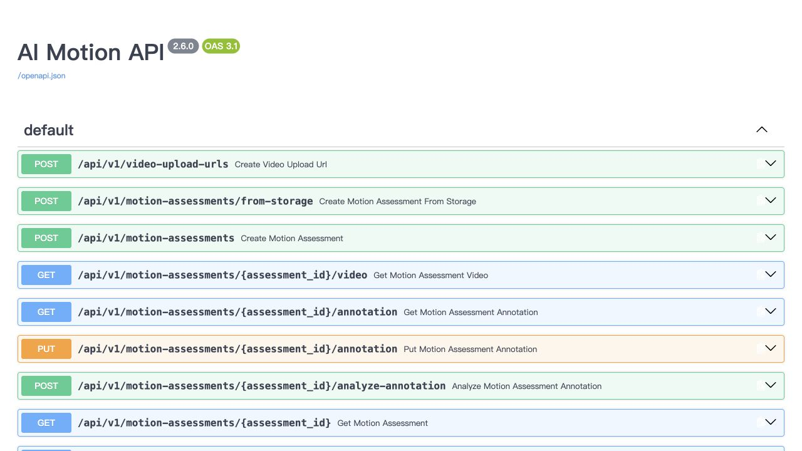
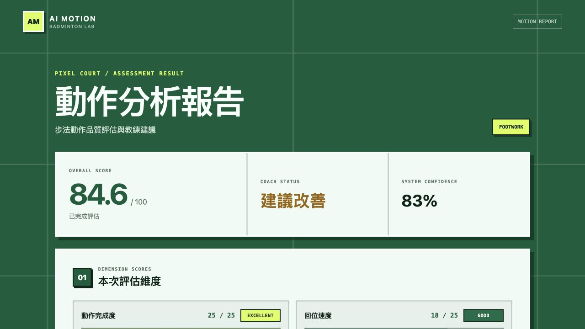
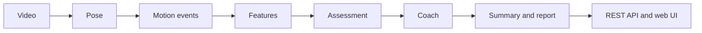

# 🏸 AI Motion Platform

AI-powered badminton motion assessment built with FastAPI, MediaPipe Pose,
OpenCV, and a browser-based JavaScript interface.

The platform accepts a training video, extracts pose and motion features,
evaluates the movement with rule-based assessment and coaching engines, and
returns an explainable interactive report through REST APIs.

## Demo

### Home

Choose a badminton motion, upload or record a video, and select the movement
segment to analyze.



### REST API

FastAPI provides an interactive Swagger interface for the complete assessment
and progress API.



### Motion report

The report combines dimension scores, confidence, explainable movement
visualizations, AI Coach feedback, and training suggestions.



## Features

- Video upload and optional segment selection
- MediaPipe pose estimation and motion event detection
- Footwork, forehand serve, and high clear assessment
- Rule-based scoring, coaching feedback, and training suggestions
- Explainable pose keyframes and motion visualizations
- Progress history and dimension-level comparisons
- Interactive reports plus JSON API output
- Local filesystem or PostgreSQL-backed assessment storage

## Architecture



## Quick start

Requirements: Python 3.13 and `ffmpeg`.

```bash
git clone https://github.com/nostang/AI-Motion-Platform.git
cd AI-Motion-Platform
python -m venv .venv
source .venv/bin/activate
pip install -r requirements.txt
cp .env.example .env
uvicorn api_main:app --reload --port 8000
```

Open <http://127.0.0.1:8000>. FastAPI serves both the web interface and the API;
interactive API documentation is available at <http://127.0.0.1:8000/docs>.

For a production-oriented installation, use `requirements.runtime.txt` or the
included `Dockerfile`.

## Main API flow

Create an assessment:

```http
POST /api/v1/motion-assessments
```

Poll its status:

```http
GET /api/v1/motion-assessments/{assessment_id}
```

Read the completed report:

```http
GET /api/v1/motion-assessments/{assessment_id}/report
```

The full interface and response contracts are indexed in
[`docs/README.md`](docs/README.md).

## Project structure

```text
AI-Motion-Platform/
├── frontend/       Browser UI, styles, scripts, and capture guides
├── src/            Pose, motion, assessment, coach, report, and API modules
├── tests/          Automated unit, contract, API, and frontend tests
├── docs/           Specifications, API contracts, releases, and calibration notes
├── models/         MediaPipe model assets required at runtime
├── dataset/        Dataset metadata; local videos are intentionally ignored
├── scripts/        End-to-end checks
├── tools/          Calibration and shadow-comparison utilities
├── migrations/     Database migrations
├── infra/          Deployment and storage configuration
├── api_main.py     FastAPI entry point
└── main.py         Local dataset analysis entry point
```

Generated reports, uploaded videos, local datasets, virtual environments,
caches, and `.env` files are excluded from Git. See `.gitignore` for the full
list.

## Current version

The latest documented L3 release is **v1.3.0-L3**, with Footwork, Forehand
Serve, and High Clear motion modules. The current feature line also includes
productionized Body Stability V2 scoring, progress comparisons, and explainable
motion insights.

- [v1.3.0-L3 release notes](docs/Release/v1.3.0-L3.md)
- [v1.0.0-L3 freeze contract](docs/Release/v1.0.0-L3.md)
- [Documentation index](docs/README.md)

## Testing

Run the complete automated suite from the repository root:

```bash
python -m pytest -q
```

## License

Licensed under the [MIT License](LICENSE).

## Author

Developed by **Yu-Yin Tang**.

AI Motion Platform is an experimental project exploring AI-assisted badminton
motion analysis using computer vision and modern web technologies.
