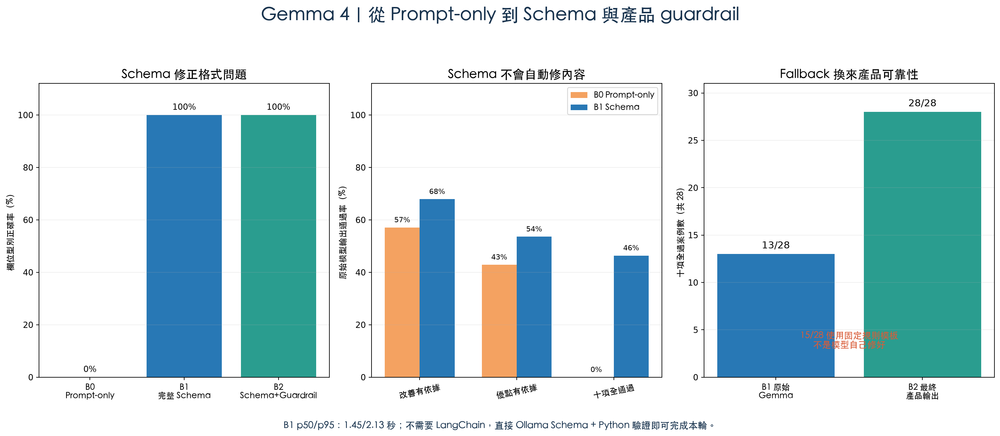

# A vs B：同條件 28 案例結論

日期：2026-09-27

## 先講結論

Gemma 4 不是不能用。補上 Ollama 完整 JSON Schema 後，欄位型別由 0% 升到 100%，證明原先格式問題主要是整合方式，不是模型完全無能力。

但 Schema 只修格式，不會自動修內容。Gemma 原始輸出的改善依據為 67.9%、優點依據為 53.6%，十項全部通過 46.4%（13/28）。加入程式驗證與固定模板 fallback 後，產品最終輸出可達 28/28，但有 15/28 使用 fallback；這個 100% 是系統可靠性，不是 Gemma 原始品質。

## 三個 B 階段

| 階段 | 做法 | 型別正確 | 十項全過 | 意義 |
|---|---|---:|---:|---|
| B0 | Prompt + `format: json` | 0% | 0% | JSON 合法，但欄位型別未被強制 |
| B1 | Prompt + 完整 JSON Schema | 100% | 46.4%（13/28） | 格式已解決，剩下內容依據問題 |
| B2 | Schema + 驗證 + 固定模板 fallback | 100% | 100%（28/28） | 15/28 使用 fallback，不等於模型 100% |

本輪沒有使用 LangChain。直接使用 Ollama Schema、Python 驗證與 deterministic fallback 就能完成，因此 LangChain 是日後多模型/多步驟編排選項，不是解決此問題的必要條件。

## A 與 B1 的公平比較

A、B 都使用相同 28 案例、`minimal` 輸入、v3 提示詞與五欄 Schema。A 的 Schema 由 Gemini API 提供，B 的 Schema 直接傳給本機 Ollama。

| 指標 | A：雲端 Gemini | B1：地端 Gemma + Schema | 解讀 |
|---|---:|---:|---|
| 完成 | 28/28 | 28/28 | 兩者都能產生輸出 |
| p50 | 1.6191 秒 | 1.4489 秒 | B 本機稍低 |
| p95 | 2.4000 秒 | 2.1314 秒 | 兩者接近 |
| 精確五個 key | 100% | 100% | 格式都固定 |
| 欄位型別正確 | 100% | 100% | Schema 解決 B0 的型別問題 |
| priority 有輸入依據且無新增 | 100% | 67.9% | B 仍可能翻譯掉 ID 或自行新增 |
| strength 有依據或明確無資料 | 100% | 53.6% | B 內容 grounding 仍不穩 |
| 十項全部通過 | 100% | 46.4% | B 原始輸出 13/28 全過 |

A 的 100% 只代表固定 corpus 通過自動 contract/grounding 規則，不代表所有羽球教練內容永遠正確；人工盲評仍待完成。

## B2 是怎麼做到 100%

1. 先用 Schema 固定五欄型別。
2. 程式驗證 key、型別、分數、限制、繁中及 strength/priority 是否引用輸入 ID。
3. 確定性的字串/陣列錯誤才做正規化，不讓另一個 LLM「修」答案。
4. 內容仍不合格時，不重試猜答案，直接用原始 MediaPipe/規則結果建立固定模板。

本輪 13/28 原始 Gemma 輸出直接通過，15/28 進入固定模板。這能保護產品，但 fallback 比例 53.6% 仍偏高，代表若要把 B 當主要方案，還需要改善 prompt、模型或資料表示。

## 為什麼目前仍選 A

- A 原始輸出 28/28 通過，不需要 53.6% fallback。
- B 可透過工程補強達到安全輸出，適合離線、固定場館或特殊隱私需求。
- B 每個執行端仍要有約 7.2 GB 模型、至少 16 GB RAM、Ollama、版本管理與 guardrail。
- A 可集中更新模型、Schema、提示詞、驗證器與 fallback，不把硬體及維護負擔交給一般使用者。

因此正確結論不是「Gemma 很爛」，而是：

> Gemma 4 可以做成可用的 B 方案；Schema 已解決格式問題，程式 guardrail 也能保證安全輸出。但目前超過一半案例仍需固定模板接手，且地端硬體與維護成本仍存在，所以 A 適合作為預設方案，B 適合作為可控的離線備案。

## 尚未完成的人工證據

已建立新的 [`results/ab_schema_28_case_blind_human_review.csv`](results/ab_schema_28_case_blind_human_review.csv)，用 A 與 B1 Schema 原始輸出共 56 列進行匿名評分。評分者需填 grounding、helpfulness、clarity、hallucination；不能用 B2 固定模板結果冒充模型品質。

## 原始證據

- A：[`results/gemini_35_flash_lite_28_case_minimal_v3.json`](results/gemini_35_flash_lite_28_case_minimal_v3.json)
- B0 Prompt-only：[`results/gemma4_28_case_minimal_v3.json`](results/gemma4_28_case_minimal_v3.json)
- B1 Schema：[`results/gemma4_28_case_schema_v3.json`](results/gemma4_28_case_schema_v3.json)
- B1 品質：[`results/gemma4_28_case_schema_v3_quality.json`](results/gemma4_28_case_schema_v3_quality.json)
- B2 Guardrail：[`results/gemma4_28_case_schema_guarded_v3.json`](results/gemma4_28_case_schema_guarded_v3.json)
- B2 品質：[`results/gemma4_28_case_schema_guarded_v3_quality.json`](results/gemma4_28_case_schema_guarded_v3_quality.json)
