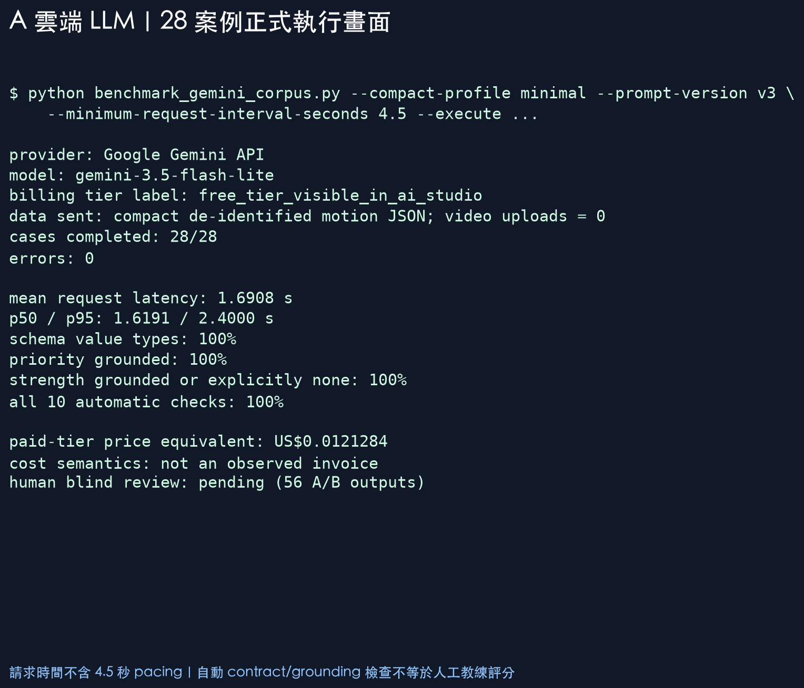
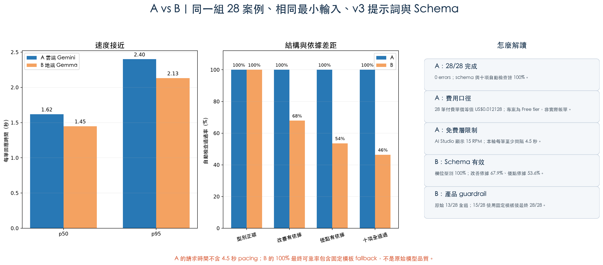

# A：雲端 LLM 隔離實驗

日期：2026-09-26～2026-09-27

目前狀態：**隔離的 Free tier 測試專案已完成 smoke test、9 個模擬案例及正式 28 案例；沒有部署或接觸羽球＋1正式資源。**

這一頁只處理 A 的「雲端 LLM 解說層」。MediaPipe 另有本機基準。本實驗不部署羽球＋1、不讀正式資料庫、不上傳影片，也不建立 VM、Cloud Run、bucket、queue 或自訂 IAM。Google AI Studio 建立 key 時在隔離專案自動綁定同名服務帳戶；實驗完成後 API key 已刪除，服務帳戶仍留待另行確認是否移除。

## 1. 用一句話理解這個實驗

既有 MediaPipe 與規則引擎先產生固定分數；Gemini 只把精簡 JSON 說成人話。它像報告翻譯員，不是裁判，也不能改分數。

本輪使用 Google Gemini API 的 `gemini-3.5-flash-lite` 與 structured output。2026-09-26 查得的 standard paid tier 公開單價為 input US$0.30 / 1M tokens、output（含 thinking）US$2.50 / 1M tokens。

- [官方模型清單](https://ai.google.dev/gemini-api/docs/models)
- [Gemini 3.5 Flash-Lite](https://ai.google.dev/gemini-api/docs/models/gemini-3.5-flash-lite)
- [官方價格](https://ai.google.dev/gemini-api/docs/pricing)
- [Structured outputs](https://ai.google.dev/gemini-api/docs/structured-output)

## 2. 實際送了什麼

正式比較使用 `minimal` profile，每案只送：

- 動作類型、評估狀態、既有總分與系統信心。
- 既有優點、改善優先項目與前兩項限制。
- 不送影片、檔案路徑、姓名、帳號、裝置資訊，也不送不需要的完整分項內容。

LLM 必須輸出五個固定欄位：`summary`、`strength`、`priority`、`drill`、`caution`。`summary` 與 `caution` 必須是字串，其餘三個必須是字串陣列；提示詞禁止改分、假裝看見球拍或羽球，以及做醫療診斷。

## 3. 實驗順序

1. 零網路乾跑 28 例，確認資料邊界與最壞費用上限。
2. 只用一筆純模擬案例 smoke test，確認授權、schema 與 token usage。
3. 跑 9 筆模擬壓力案例，修正「證據不足時 strength 可為空」的評估規則。
4. 第一次全量執行遇到 Free tier 速率限制；AI Studio 顯示 15 RPM、250K TPM、500 RPD。
5. 加入每次請求起點至少相隔 4.5 秒，再跑完整 28 例。
6. 用完全相同的 `minimal` 輸入、v3 提示規則及十項自動檢查重跑地端 Gemma 4。
7. 隱藏提供者、隨機排列 56 份輸出，建立人工盲評表。

刻意等待的 4.5 秒只為遵守 15 RPM，沒有算入單筆 API 回應時間。

## 4. A 的正式 28 案例結果

| 項目 | 結果 |
|---|---:|
| 完成 | 28/28 |
| 錯誤 | 0 |
| 平均 API 回應時間 | 1.6908 秒 |
| p50 / p95 | 1.6191 / 2.4000 秒 |
| 五欄與欄位型別正確 | 100% |
| 改善項目有輸入依據 | 100% |
| 優點有輸入依據或明確表示無資料 | 100% |
| 十項自動檢查全部通過 | 100%（28/28） |
| 28 筆 paid-tier 單價等值 | US$0.0121284 |

專案介面顯示為 **Free tier**。US$0.0121284 是依實際 token usage 套用 paid-tier 公開單價的「比較等值」，不是實際帳單，也不能寫成已付款費用。平均約為 US$0.000433/案。

原始證據：

- [`results/gemini_35_flash_lite_28_case_minimal_v3.json`](results/gemini_35_flash_lite_28_case_minimal_v3.json)
- [`results/gemini_35_flash_lite_28_case_minimal_v3_quality.json`](results/gemini_35_flash_lite_28_case_minimal_v3_quality.json)
- [`results/gemini_35_flash_lite_28_case_minimal_v3_review.csv`](results/gemini_35_flash_lite_28_case_minimal_v3_review.csv)

## 5. 與 B 的同條件比較

| 指標 | A：雲端 Gemini | B1：地端 Gemma 4 + Schema |
|---|---:|---:|
| p50 | 1.6191 秒 | 1.4489 秒 |
| p95 | 2.4000 秒 | 2.1314 秒 |
| 五個 key 齊全 | 100% | 100% |
| 欄位型別正確 | 100% | 100% |
| 改善項目有依據且無新增 | 100% | 67.9% |
| 優點有依據或明確無資料 | 100% | 53.6% |
| 十項全部通過 | 100% | 46.4%（13/28） |

B0 Prompt-only 曾出現 0% 型別率；將完整 Schema 傳給 Ollama 後，B1 型別立即升到 100%，證明格式問題主要在整合方式。Schema 不會自動修正內容，因此 B1 仍只有 13/28 十項全過。再加入程式驗證與固定模板 fallback 後，B2 最終可達 28/28，但其中 15/28 是 fallback，不可當成模型原始品質。

A 與 B 的速度接近，B1 本機甚至稍低；支持選 A 的主要證據是原始 grounding、集中維運與終端硬體門檻，不是速度或「Gemma 不能用」。完整解讀見 [A vs B 同條件結論](AB_CLOUD_LOCAL_COMPARISON.zh-TW.md)。

## 6. 十項自動檢查是什麼

1. key 精確一致。
2. 欄位型別正確。
3. 必要值非空。
4. priority ID 來自輸入。
5. strength 有依據，或在證據不足時明確留空。
6. 不竄改分數。
7. 有承認單攝影機 2D 等限制。
8. 不聲稱直接看見影片、球拍或羽球。
9. 證據不足時不硬給結論。
10. 基本繁體中文檢查。

這些只能證明「遵守合約與已知證據」，不能取代人工判斷是否真的有幫助。因此已建立 [`results/ab_schema_28_case_blind_human_review.csv`](results/ab_schema_28_case_blind_human_review.csv)，使用 A 與 B1 Schema 的原始輸出共 56 列，待人工評 grounding、helpfulness、clarity、hallucination；提供者對評分者隱藏，對照表另存且評分前不應開啟。

## 7. 安全邊界

1. 工具預設 dry-run；必須同時指定 `--execute` 且存在獨立 `GEMINI_API_KEY` 才能連網。
2. API host 固定為 Google Gemini API，不能改成羽球＋1服務。
3. 只讀固定 corpus manifest，不讀資料庫、bucket 或正式 API。
4. 不送影片或路徑；結果不保存金鑰。
5. 預估超過 US$0.05 即停止；不自動重試；400、401、403 立即停批次。
6. 使用隔離測試專案與臨時金鑰，沒有使用羽球＋1設定。

2026-09-27 收尾時已在 Google Cloud 憑證頁刪除 `AI Motion PoC 28 Case Test` API key，並確認 API 金鑰清單為空。頁面仍列出 AI Studio 自動綁定的同名服務帳戶；它不是羽球＋1資源，且刪除服務帳戶是另一個外部破壞性動作，因此未擅自刪除。

Free tier 內容依官方頁面可能用於改善產品。本次資料已去識別且不含影片，但真實影片衍生指標仍應視為資料治理議題；正式產品需改用合適的付費資料條款並完成隱私/法務審查。

## 8. 現在能說與不能說

可以說：

> 在相同 28 案例、最小輸入、v3 提示詞與 Schema 下，A 原始輸出 28/28 全過；B 的型別也達 100%，但原始十項全過為 13/28，另有 15/28 需要固定模板 fallback。Gemma 可用，但 A 目前較適合作為預設方案。

不能說：

> A 已證明整體羽球產品一定比 B 準，或已完成正式雲端成本與端到端部署驗證。

仍未測得的項目是完整影片上傳、Cloud Run 冷啟動與 MediaPipe 雲端硬體差異、正式 Storage/DB/network 帳單、多人壓測，以及人工教練盲評。
