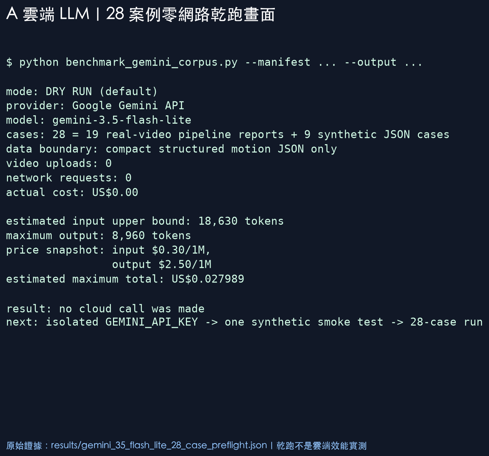

# A：雲端 LLM 隔離實驗

日期：2026-09-26

目前狀態：**測試工具與 28 案例乾跑已完成；真實雲端 API 尚未執行。**

這一頁只處理 A 的「雲端 LLM 解說層」。MediaPipe 已有另外的本機基準。本實驗不部署羽球+1、不讀正式資料庫、不上傳影片，也不建立 VM、Cloud Run、bucket、queue、service account 或 IAM。

## 1. 為什麼選這個模型做比較

本輪預設使用 Google Gemini API 的 `gemini-3.5-flash-lite`。Google 目前把它列為穩定、偏向高量低成本的模型，並支援 structured outputs；官方模型頁也說明新專案應優先使用目前的 3.5 Flash-Lite，而不是把舊的 2.5 單價直接當成今日方案。

- [官方模型清單](https://ai.google.dev/gemini-api/docs/models)
- [Gemini 3.5 Flash-Lite 模型說明](https://ai.google.dev/gemini-api/docs/models/gemini-3.5-flash-lite)
- [官方價格](https://ai.google.dev/gemini-api/docs/pricing)
- [Structured outputs 說明](https://ai.google.dev/gemini-api/docs/structured-output)

2026-09-26 查得的 standard paid tier 公開單價為：input US$0.30 / 1M tokens、output（含 thinking）US$2.50 / 1M tokens。價格會變動，正式報告前應再次查價。

## 2. 實驗資料到底送什麼

每一案只送既有 MediaPipe 與規則引擎報告的精簡 JSON：

- 動作類型、評估狀態、既有總分、系統信心。
- 分項規則結果。
- 既有優點、改善優先項目與限制。
- 不送影片、不送檔案路徑、不送姓名、帳號或裝置資訊。

LLM 只能產生五個欄位：`summary`、`strength`、`priority`、`drill`、`caution`。分數仍由規則引擎決定，LLM 不可改分數，也不可聲稱看到球拍或羽球。

## 3. 已完成的零網路乾跑

執行 [`benchmark_gemini_corpus.py`](benchmark_gemini_corpus.py)，讀取與 B 完全相同的 28 案例 manifest，但沒有加 `--execute`。

| 項目 | 結果 |
|---|---:|
| 案例 | 28（19 真實影片流程輸出 + 9 模擬壓力 JSON） |
| 上傳影片 | 0 |
| API 請求 | 0 |
| 實際費用 | US$0 |
| 保守估計 input 上限 | 18,630 tokens |
| output 上限 | 8,960 tokens |
| 全部 28 案例最高估計費用 | US$0.027989 |

這個費用是「執行前安全上限」，不是帳單或實測平均。input token 以 UTF-8 bytes / 2 做保守估計；output 則故意用每案完整 320 tokens 計算。原始證據在 [`results/gemini_35_flash_lite_28_case_preflight.json`](results/gemini_35_flash_lite_28_case_preflight.json)。



## 4. 工具如何保護羽球+1

1. 預設只 dry-run；沒有明確加 `--execute` 就不會連網。
2. 真實執行還必須另外存在 `GEMINI_API_KEY`。
3. API host 固定為 Google Gemini API，不能從參數改成羽球+1服務。
4. 只讀固定 corpus manifest，不讀資料庫、bucket 或正式 API。
5. 送出的內容是精簡 JSON，不含影片或檔案路徑。
6. 預設費用安全上限 US$0.05；預估超過即停止。
7. 不自動重試；若遇到 400、401、403，立即停止後續案例。
8. 金鑰只放 request header，不寫入結果、不放 URL、不提交 Git。

## 5. 真實 API 的正確測試順序

目前環境沒有 `GEMINI_API_KEY`，所以以下步驟尚未執行：

1. 建立與羽球+1正式專案無關的 Gemini 測試金鑰，設定很小的預算或用量限制。
2. 先只跑模擬案例 `S-SV-01`，驗證授權、JSON schema、token usage 與費用。
3. 確認輸出沒有敏感資訊、沒有改分數、沒有假裝看見影片。
4. 才跑全部 28 案例。
5. 用與 B 相同的九項自動檢查及人工盲評表，比較 A 與 B。
6. A/B 的輸出需隱藏模型名稱、隨機排序，再由人評 grounding、helpfulness、clarity、hallucination。

單案 smoke test 指令：

```bash
.venv/bin/python experiments/offline_abc/benchmark_gemini_corpus.py \
  --manifest experiments/offline_abc/results/ab_corpus_manifest.json \
  --case-id S-SV-01 \
  --execute \
  --output experiments/offline_abc/results/gemini_35_flash_lite_smoke.json
```

全部 28 案例只有在 smoke test 通過後才執行。

## 6. 公平比較要看哪些數字

| 面向 | A 與 B 都要量 |
|---|---|
| 結構可靠性 | JSON 可解析率、五欄完整率、精確 schema 率 |
| 內容依據 | priority 與 strength 是否真的來自輸入 |
| 安全性 | 是否改分數、假裝看見畫面、忽略證據不足 |
| 語言 | 繁體中文、清楚度、可實行性 |
| 速度 | p50、p95；A 額外記錄網路延遲，B 額外記錄冷啟動 |
| 成本與設備 | A 每案實際 token 費；B 模型大小、RAM 與 VM 情境 |
| 多人能力 | A 的 rate limit/併發；B 的本機排隊吞吐 |

Structured outputs 可以提高「格式正確率」，但官方也明確提醒：schema 正確不保證內容語意正確。因此 A 即使 28/28 都符合 schema，仍然要做與 B 相同的 grounding 與人工盲評，不能直接宣布 A 比 B 準。

## 7. 現在能說與不能說的話

可以說：

> 我已把 A 的雲端 LLM 測試隔離成只送結構化 JSON的工具，28 案例乾跑完成，沒有發出 API 請求；依當日單價，整批最壞估計低於 US$0.028。

不能說：

> A 已實測比 B 快、準或便宜。

因為沒有獨立測試金鑰，目前還沒有 A 的真實延遲、token 用量、輸出品質與帳單證據。

## 8. 隱私提醒

官方價格頁目前標示：free tier 的內容可能用於改善產品，paid tier 則標示不會。雖然本實驗已移除影片與身份資料，真實影片衍生的動作指標仍建議使用隔離的 paid 測試專案；若只想先驗證連線，可先用純模擬案例 smoke test。
