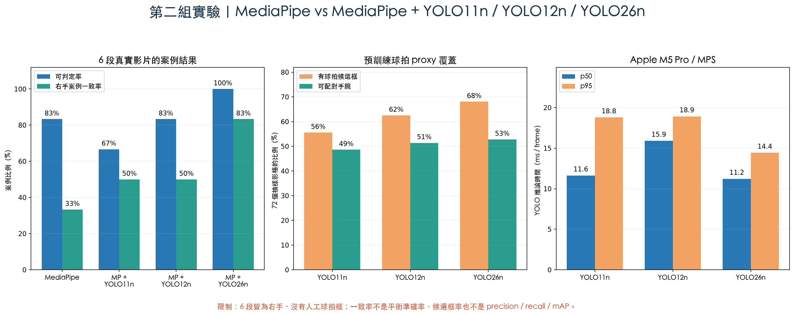

# 第二組實驗：MediaPipe vs MediaPipe＋YOLO

## 一句話結論

這一組的正確比較不是「MediaPipe 或 YOLO 二選一」，而是：

`MediaPipe 人體骨架` **vs** `MediaPipe 人體骨架 + YOLO 球拍物件證據`

在目前 6 段真實、全為右手持拍的發球影片上，預訓練 **YOLO26n** 比 YOLO11n、YOLO12n 更適合做下一輪資料標註與微調起點；但本輪沒有左手影片、也沒有人工球拍框，所以只能說它在這批右手案例的初步一致率較高，不能宣稱已得到完整準確率或 mAP。

## 為什麼測 YOLO11n、YOLO12n 與 YOLO26n

- Ultralytics 的 YOLO12 文件把 YOLO12 說明為社群模型，並建議穩定工作負載使用 YOLO11 或 YOLO26。
- Ultralytics 的模型文件把 YOLO26列為最新一代，YOLO11則是成熟、穩定的上一代選擇。
- 使用者希望三代都實測，因此本輪把三個最小的 `n` 版本放進完全相同的 PoC；YOLO12n 雖不是官方首選，仍保留作中間世代對照。

官方來源：

- [Ultralytics YOLO12 文件](https://docs.ultralytics.com/models/yolo12/)
- [Ultralytics 模型總覽](https://docs.ultralytics.com/models/)
- [MediaPipe Pose Landmarker](https://developers.google.com/edge/mediapipe/solutions/vision/pose_landmarker)

## 從零理解兩個工具在做什麼

- **MediaPipe 像人體骨架貼紙機**：它在人的肩、手肘、手腕等位置貼點。本專案用這些點計算動作與固定分數。
- **YOLO 像物件圈選員**：它在影格中把球拍圈起來。本輪使用 COCO 預訓練的 `tennis racket` 類別，當作羽球拍的初步 proxy。
- **組合方式**：先讓 YOLO 找球拍框，再看球拍框離 MediaPipe 左手腕或右手腕哪一個比較近；不是讓 YOLO 重做人體骨架或改掉既有分數。

## 實驗資料與公平條件

| 項目 | 本輪設定 |
|---|---|
| 真實影片 | 6 段去重後的發球影片 |
| 人工答案 | 6 段皆標示右手持拍 |
| 抽樣影格 | 每段在人工作用時間窗內均勻取 12 張，共 72 張 |
| MediaPipe | Pose Landmarker，取肩膀與左右手腕 |
| YOLO 輸入 | 1280 px、confidence 0.15 |
| 配對規則 | 手腕 visibility ≥ 0.5，球拍候選需在 2.5 個肩寬內 |
| 案例判定 | 至少 2 張成功配對，且同一側票數 ≥ 60%；否則 `unknown` |
| 硬體 | Apple M5 Pro，MPS |
| 軟體 | Python 3.11.16、PyTorch 2.14.0、Ultralytics 8.4.163 |

三個 YOLO 使用完全相同的 72 張影格、尺寸、信心門檻與配對規則。沒有對這 6 段影片微調，也沒有讓其中一個模型得到額外資料。

## 實測結果

| 指標 | MediaPipe | MP＋YOLO11n | MP＋YOLO12n | MP＋YOLO26n |
|---|---:|---:|---:|---:|
| 可判定案例 | 5/6（83.3%） | 4/6（66.7%） | 5/6（83.3%） | 6/6（100%） |
| 全部 6 案例的右手一致 | 2/6（33.3%） | 3/6（50.0%） | 3/6（50.0%） | 5/6（83.3%） |
| 只看可判定案例的一致 | 2/5（40.0%） | 3/4（75.0%） | 3/5（60.0%） | 5/6（83.3%） |
| 有球拍候選框的影格 | 不適用 | 40/72（55.6%） | 45/72（62.5%） | 49/72（68.1%） |
| 可與手腕配對的影格 | 不適用 | 35/72（48.6%） | 37/72（51.4%） | 38/72（52.8%） |
| YOLO p50 / p95 | 不適用 | 11.6 / 18.8 ms | 15.9 / 18.9 ms | 11.2 / 14.4 ms |

### 模型檔與可重現資訊

| 模型 | 參數量 | 權重大小 | SHA-256 |
|---|---:|---:|---|
| YOLO11n | 2,624,080 | 5,613,764 bytes | `0ebbc80d4a7680d14987a577cd21342b65ecfd94632bd9a8da63ae6417644ee1` |
| YOLO12n | 2,603,056 | 5,595,063 bytes | `419ff3dca37d69bacc93a50fa0c186a1c6f9fe62fae0f108b0872829689e9ca6` |
| YOLO26n | 2,572,280 | 5,544,453 bytes | `9b09cc8bf347f0fc8a5f7657480587f25db09b34bf33b0652110fb03a8ad4fef` |

權重來源均記錄為 [Ultralytics assets v8.4.0](https://github.com/ultralytics/assets/releases/tag/v8.4.0)。

## 逐案例結果

所有人的人工答案都是右手，因此表中的「一致」只代表右手案例是否符合，不能代表左右手平衡準確率。

| 案例 | YOLO11n（左/右票） | YOLO12n（左/右票） | YOLO26n（左/右票） |
|---|---|---|---|
| R-SV-01 | unknown（4/3） | left，不一致（5/3） | right，一致（4/6） |
| R-SV-02 | left，不一致（4/1） | left，不一致（5/1） | left，不一致（3/2） |
| R-SV-03 | right，一致（0/5） | right，一致（0/5） | right，一致（0/4） |
| R-SV-04 | right，一致（0/7） | right，一致（0/7） | right，一致（0/6） |
| R-SV-05 | unknown（0/1） | unknown（0/1） | right，一致（0/3） |
| R-SV-06 | right，一致（4/6） | right，一致（4/6） | right，一致（4/6） |

## 失敗案例真正告訴我們什麼

R-SV-02 中，三個 YOLO 都有找到球拍，但球拍被配到 MediaPipe 的 `left wrist`；人工答案則是右手。這不像是單純「YOLO 看不到球拍」，更像是影片鏡像、前後鏡頭或左右語意沒有正規化。

因此只微調 YOLO 不一定能修好這一案。下一輪還要：

1. 在影片 metadata 加入是否鏡像、前鏡頭或後鏡頭。
2. 用一個已知動作做左右校正，或在輸入前統一反鏡像。
3. 保留 `unknown`，不要在左右證據接近時強迫猜答案。

## 這不是「已自行訓練完成」

本輪使用官方預訓練權重，**沒有**用專案影片微調。原因是目前缺少兩種關鍵人工答案：

- 左手持拍影片：目前是 0 段。
- 每張影格的人工球拍框：目前是 0 張。

沒有人工框，就不能誠實計算 precision、recall、mAP；目前的「候選框影格率」只表示模型有輸出球拍候選，不等於候選一定正確。也不應把模型自己的預測當答案再訓練，然後稱為準確率。

## 決策

1. **保留 MediaPipe**：它仍負責人體骨架、現有動作規則與固定分數。
2. **YOLO 作為加掛證據**：只補足球拍、羽球與未來球路等 MediaPipe 不擅長的物件資訊。
3. **下一輪主模型選 YOLO26n**：本輪在候選框覆蓋、案例可判定率、右手一致率與 p95 延遲都優於 YOLO11n、YOLO12n。
4. **YOLO11n、YOLO12n 留作控制組**：YOLO12n 的候選框覆蓋高於 YOLO11n，但案例一致同為 3/6，而且 p50 最慢，沒有超越 YOLO26n。
5. **先補資料再微調**：至少先收左手案例、鏡像資訊與人工球拍框；固定 test set 後再報 precision、recall、mAP 與左右手 confusion matrix。

後續已把 YOLO26n、26s、26m 各跑三輪。較大的 s、m 雖看到更多候選，右手案例一致只有 4/6，低於 26n 的 5/6，而且延遲與權重更高；因此單人 MVP 仍選 26n。詳見 [YOLO26 n／s／m 地端實測報告](C_YOLO26_SCALE_COMPARISON.zh-TW.md)。

這不改變 A/B 的解說層結論：A 仍是目前預設的雲端解說方案；MediaPipe＋YOLO26n 是可以在未來加到 A 或 B 前面的視覺增強，不是新的 LLM 方案。

## 原始證據

- [四方案比較結果 JSON](results/mp_yolo11_yolo12_yolo26_hand_comparison.json)
- [72 張抽樣影格與 MediaPipe 關節資料](results/mp_yolo_hand_corpus.json)
- [建立測試集程式](build_mp_yolo_hand_corpus.py)
- [YOLO 比較程式](benchmark_mp_yolo_hand.py)

從來源影片擷取的逐張證據畫面只保留在 Git 忽略的本機工作區，避免把可能有肖像或影片權利的影格推到公開 repository；版本庫只保留數字、雜湊、程式與不含原始人物畫面的比較圖。
