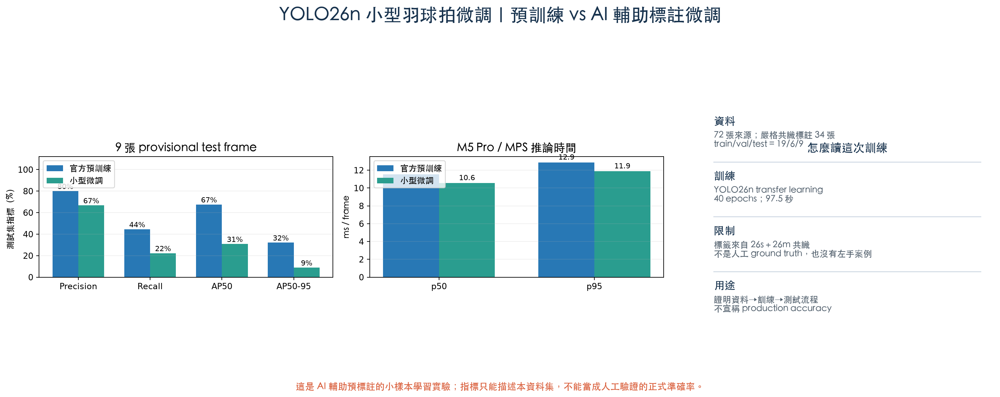

# YOLO26n 小型羽球拍微調實驗報告

## 一句話結論

這次確實完成了 **資料建立 → 標註 → 切分 → 5 epochs 短測 → 40 epochs 正式微調 → 保留影片測試**。但小型微調沒有改善模型：在 9 張 provisional test frames 上，AP50 從預訓練模型的 **67.46% 降到 30.76%**，recall 從 **44.44% 降到 22.22%**。因此這次最重要的成果不是一個更準的模型，而是用真實結果證明：**34 張 AI 預標註資料不足以取代人工資料集；現階段不要把這個微調權重放進 MVP。**

## 這次到底訓練了什麼

把 YOLO 想成會在圖片上畫方框的學生：

- 輸入：一張羽球影片影格。
- 正確答案格式：球拍外面的一個方框。
- 訓練：讓模型反覆比較自己畫的框和答案框，調整內部參數。
- 推論：訓練後給它沒看過的影片，看看能不能自己找到球拍。

這次不是從零打造一個模型，而是用官方預訓練 `YOLO26n` 做 **transfer learning（遷移學習／微調）**。也就是保留它原本看一般物件的能力，再用少量專案資料教它更專注羽球拍。這是小資料 PoC 比較合理的方式。

## 資料怎麼來

### 來源

- 6 段真實右手發球影片。
- 每段固定抽 12 張，共 72 張來源影格。
- 沿用先前同條件 YOLO26 n／s／m 實驗的影格，不另碰「羽球＋1」。

### 為什麼叫 AI 輔助預標註

目前沒有人工逐張畫好的球拍框。為了讓我先完成一次訓練經驗，本輪用 `YOLO26s` 與 `YOLO26m` 當兩位「助教」：只有兩者都看到球拍，而且方框 IoU 至少 0.65、各自 confidence 至少 0.40，才把平均框當作 provisional label。

這些框經過視覺抽查，但仍明確標記為：

`provisional_ai_assisted_not_human_ground_truth`

也就是「可以拿來學流程，不是人工真相」。視覺抽查也看到部分框偏寬、包含手臂或背景，證明即使兩個模型同意也可能一起判錯。

### 篩選與切分

| 項目 | 數量 |
|---|---:|
| 原始來源影格 | 72 |
| 通過嚴格雙模型共識 | 34 |
| 排除 | 38 |
| train | 19 |
| validation | 6 |
| test | 9 |

不是隨機把相鄰影格打散，而是用完整來源影片切分：

- train：R-SV-01、02、03、05
- validation：R-SV-04
- test：R-SV-06

因此同一段影片不會同時出現在 train 和 test。這能避免模型只是記住幾乎一樣的相鄰畫面，得到虛假的高分。

## 實際訓練步驟

1. 先用原始官方 YOLO26n 在 test 跑 baseline。
2. 執行 5 epochs smoke test，確認資料、MPS、訓練與存檔流程都正常。
3. 從同一份官方預訓練權重重新開始 40 epochs 正式微調，沒有把 smoke model 接著訓練。
4. 每個 epoch 用 validation 影片檢查。
5. 取 validation 表現最佳的 `best.pt`。
6. 用完全沒參與訓練的 R-SV-06 測 baseline 與 fine-tuned model。
7. 固定 confidence 0.15、IoU 0.50 計算 precision、recall、F1；另以 101-point interpolation 計算 AP50 與 AP50-95。

## 設備與設定

| 項目 | 實測設定 |
|---|---|
| 電腦 | Apple M5 Pro |
| 加速 | PyTorch MPS |
| Ultralytics | 8.4.163 |
| PyTorch | 2.14.0 |
| 基礎模型 | YOLO26n 官方預訓練權重 |
| 輸入尺寸 | 640 × 640 |
| batch | 8 |
| seed | 26 |
| smoke test | 5 epochs，16.889 秒 |
| 正式訓練 | 40 epochs，97.535 秒 |
| 最佳權重 | 5,367,685 bytes |
| 最佳權重 SHA-256 | `3a78960187c015f3daec8552220267d9a293f844951533824be9ad822807c24b` |

模型權重、原始人物影格、標註稽核圖與逐 epoch 大型產物保留在 Git 忽略的本機 workspace；GitHub 只保存重跑程式、摘要 JSON、統計圖與報告。

## 測試結果

### 固定 test set 前後比較

| 指標 | 官方預訓練 YOLO26n | 40 epochs 微調 | 變化 |
|---|---:|---:|---:|
| Precision | **80.00%** | 66.67% | -13.33 個百分點 |
| Recall | **44.44%** | 22.22% | -22.22 個百分點 |
| F1 | **57.14%** | 33.33% | -23.81 個百分點 |
| AP50 | **67.46%** | 30.76% | -36.70 個百分點 |
| AP50-95 | **32.06%** | 8.82% | -23.24 個百分點 |
| 有偵測的 test frames | **5/9** | 3/9 | -2 張 |
| p50 推論 | 11.53 ms | **10.56 ms** | -0.97 ms |
| p95 推論 | 12.87 ms | **11.88 ms** | -0.99 ms |

推論快約 1 ms 不代表模型更好；兩個權重架構相近，這個差距可能只是短測波動。品質指標一致顯示微調後漏掉更多球拍。

### 訓練曲線怎麼看

本機訓練曲線在：

`results/yolo_racket_pilot_workspace/training_runs/formal/results.png`

- train box loss 大致下降，表示模型越來越會配合訓練資料。
- validation 的 AP 約到第 23 epoch 後才開始上升，第 39–40 epoch validation AP50 約 50.26%。
- 但獨立 test AP50 只有 30.76%，而且低於未微調 baseline。

這代表模型「學會這幾段訓練／驗證影片的樣子」，卻沒有更好地泛化到另一段影片。小樣本、單一右手情境與 noisy pseudo labels 是主要風險。

## 為什麼訓練後反而變差

1. **資料太少**：train 只有 19 張，而且來自 4 段影片。
2. **沒有人工 ground truth**：26s 和 26m 同意，不代表方框就一定正確。
3. **只有正樣本**：資料集沒有「畫面裡沒有球拍」的 negative frames，無法完整教 false positive。
4. **全是右手**：不能證明左手或平衡情境。
5. **影片差異大**：場館、人物尺寸、角度和球拍模糊程度不同；少量資料容易記住場景。
6. **同家族 teacher/student**：用 YOLO26s、26m 標註，再教 YOLO26n，測得的進步本來就可能偏向 teacher 的習慣，仍然沒有獨立真相。

## 這次能證明與不能證明的事

### 已證明

- 我們真的能在 M5 Pro 本機完成 YOLO26n 微調，不必為這個規模租 VM。
- 資料格式、訓練、checkpoint、held-out test、AP 與延遲量測流程都能跑通。
- 單靠 34 張 AI 共識框，微調不但沒有勝過 baseline，還明顯退步。
- 因此「有訓練」不能當作「模型更好」；一定要保留獨立 test set 比較前後。

### 不能證明

- 不能把表中的 AP 稱為正式羽球拍準確率。
- 不能推論到左手、其他球員、其他場館或完整比賽。
- 不能說 YOLO26n 不值得訓練；只能說 **這份小型 AI 預標註資料不夠**。
- 不能用這次結果改寫 A vs B 的 LLM 部署結論。

## 對目前 MVP 的決定

- 現在仍以 **MediaPipe＋規則** 為主；持拍手可讓使用者確認或修正。
- 不把這次 fine-tuned `best.pt` 放進 MVP，也不影響「羽球＋1」任何功能。
- 若 AI Motion 未來要自動找球拍，先使用先前實測較好的官方預訓練 YOLO26n 當研究 baseline。
- 真正下一輪微調前，先準備人工標註：至少左右手都有、加入 negative frames、鏡像 metadata，並依球員或拍攝場次固定 test set。

## 下一輪若要把模型做得像樣

最低限度建議：

1. 先人工校正 500–1,000 張球拍框，而不是直接相信模型共識。
2. 至少 30 位球員，左右手、正面、背面、遮擋、模糊與不同場館都要有。
3. 加入沒有球拍或球拍不可見的 negative frames。
4. 依球員切 train/val/test，test 在訓練前鎖定。
5. 同時報 object detection 指標與最終「持拍手」指標。
6. 先比較官方 baseline 和 fine-tuned model；只有 test 真正改善才採用。

這些是未來正式研究的資料門檻，不是目前單人 PoC 必須立刻投入的工作。

## 可重跑證據

- [資料集建立程式](build_yolo_racket_pilot_dataset.py)
- [微調與測試程式](train_yolo26n_racket_pilot.py)
- [證據圖產生程式](render_yolo_racket_pilot_evidence.py)
- [儀表板格式摘要 JSON](results/yolo26n_racket_finetune_pilot.json)
- [公開統計圖](assets/yolo26n_racket_finetune_pilot.png)

## 最後心得

這次「變差」不是失敗，而是比漂亮但不可信的數字更有價值。現在可以清楚說出：我會建立資料、避免影片洩漏、做 transfer learning、保留 test、比較訓練前後，也知道 pseudo label 和小樣本為什麼會讓模型過度適應。若沒有這個對照，很容易只看到 training loss 下降，就誤以為產品應該換成自訓模型。
