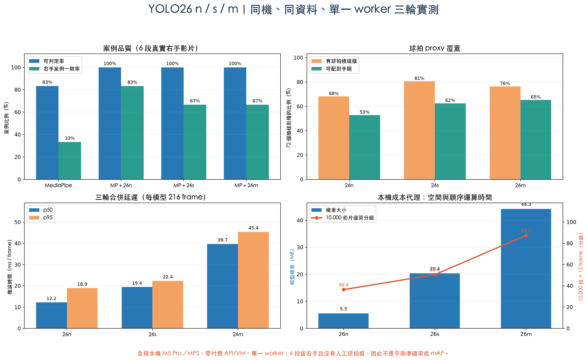

# YOLO26 n／s／m 地端實測報告

## 一句話結論

在目前「單人、地端、6 段真實右手發球影片、每段抽 12 張」的 PoC，**YOLO26n 是最合理的 MVP 選擇**。它不只最小、最快，6 段中也有 5 段符合人工右手答案；較大的 26s、26m 都只有 4 段符合。這證明模型變大會提高一般物件能力，但不保證「球拍框＋MediaPipe 手腕」這個專案規則一定更準。

## 這次到底測了什麼

這不是重新訓練三個模型，而是把官方預訓練的 YOLO26n、YOLO26s、YOLO26m 放進完全相同的 AI Motion 流程：

`影片抽幀 → MediaPipe 找左右手腕 → YOLO 找球拍框 → 球拍配對最近手腕 → 全片投票左手/右手`

- `n`、`s`、`m` 是 nano、small、medium，代表模型容量，不是收費方案。
- 三個模型都使用 COCO 的 `tennis racket` 類別作羽球拍 proxy，沒有使用本專案影片微調。
- 同一批 6 段去重真實影片、72 張影格、1280 px、confidence 0.15、Apple M5 Pro MPS。
- 每個模型在獨立程序跑 3 輪；品質結果每輪相同，時間合併 216 張影格計算。
- 全程沒有付費 API、沒有 VM、沒有雲端 GPU，也沒有改動羽球＋1。

## 實測比較表

| 指標 | MediaPipe | MP＋YOLO26n | MP＋YOLO26s | MP＋YOLO26m |
|---|---:|---:|---:|---:|
| 可判定案例 | 5/6（83.3%） | 6/6（100%） | 6/6（100%） | 6/6（100%） |
| 全部案例的右手一致 | 2/6（33.3%） | **5/6（83.3%）** | 4/6（66.7%） | 4/6（66.7%） |
| 有球拍候選框的影格 | 不適用 | 49/72（68.1%） | **58/72（80.6%）** | 55/72（76.4%） |
| 可配對手腕的影格 | 不適用 | 38/72（52.8%） | 45/72（62.5%） | **47/72（65.3%）** |
| 三輪合併 p50 / p95 | 不適用 | **12.2 / 18.9 ms** | 19.4 / 22.4 ms | 39.7 / 45.4 ms |
| 平均處理速度 | 不適用 | **54.9 frame/s** | 39.6 frame/s | 22.9 frame/s |
| 權重檔 | 不適用 | **5.54 MB** | 20.42 MB | 44.26 MB |
| 實際載入參數 | 不適用 | **2.57 M** | 10.01 M | 21.90 M |
| 程序峰值 RSS 中位數 | 不適用 | **772.17 MB** | 829.34 MB | 832.00 MB |
| 相對載入前 RSS 增量 | 不適用 | **527.48 MB** | 584.53 MB | 587.73 MB |
| 10,000 段 × 12 frame 的 YOLO 順序運算時間 | 不適用 | **36.4 分鐘** | 50.6 分鐘 | 87.5 分鐘 |
| 本輪金錢支出 | US$0 | US$0 | US$0 | US$0 |

「10,000 段」只把實測平均 YOLO 每幀時間乘上 120,000 張影格，是方便比較的本機時間代理；不含影片解碼、MediaPipe、排隊、儲存、報告與電費，也不是正式容量保證。RSS 是整個程序的峰值，不是獨立 GPU 顯存；Apple Silicon 使用共享記憶體，因此不應把它當精密 VRAM 數字。

## 為什麼 s、m 看到更多球拍，答案反而比較差

較大的模型確實提供更多球拍證據，但系統最後問的不是「有沒有看到球拍」，而是「球拍應配到哪一隻手腕」。

| 案例 | 人工答案 | 26n | 26s | 26m |
|---|---|---|---|---|
| R-SV-01 | 右 | 右（4 左／6 右） | **左（6 左／4 右）** | **左（6 左／2 右）** |
| R-SV-02 | 右 | **左（3／2）** | **左（5／2）** | **左（5／2）** |
| R-SV-03 | 右 | 右（0／4） | 右（1／5） | 右（0／6） |
| R-SV-04 | 右 | 右（0／6） | 右（0／8） | 右（0／11） |
| R-SV-05 | 右 | 右（0／3） | 右（0／3） | 右（0／4） |
| R-SV-06 | 右 | 右（4／6） | 右（4／7） | 右（4／7） |

26s、26m 在 R-SV-01 多找到一些候選，但多出的票偏向 MediaPipe 的左手腕，於是整段被判錯。R-SV-02 則三個尺寸都錯，延續先前看到的鏡像／左右語意疑慮。因此瓶頸不只在 YOLO 大小，也在鏡像 metadata、MediaPipe 左右定義、候選框與手腕的配對規則。

## 官方一般能力與本專案實測為何不同

Ultralytics 官方在 640 px COCO validation 的表格顯示，模型愈大，一般物件 mAP 愈高；但 CPU/T4 速度也愈慢。官方數字和本輪 M5 Pro、1280 px、羽球拍 proxy 不是同一硬體或任務，不能混成同一個速度排名。

| 模型 | 官方 COCO mAP50-95 | 官方 CPU ONNX | 官方 T4 TensorRT | 官方 fused params |
|---|---:|---:|---:|---:|
| YOLO26n | 40.9 | 38.9 ms | 1.7 ms | 2.4 M |
| YOLO26s | 48.6 | 87.2 ms | 2.5 ms | 9.5 M |
| YOLO26m | 53.1 | 220.0 ms | 4.7 ms | 20.4 M |

來源：[Ultralytics YOLO26 官方文件](https://docs.ultralytics.com/models/yolo26/)。官方表使用 fused model；本輪表格記錄實際下載 checkpoint 的載入參數，因此兩者會略有差異。

## 成本與使用次數

- **模型本身沒有 n／s／m 不同單價，也沒有每次推論次數限制。**本輪三個權重都在本機執行，金錢支出為 US$0。
- n／s／m 的實際成本差在下載空間、記憶體、每次運算時間與電力；本輪沒有量測瓦數，所以不虛構電費。
- 本專案是個人研究 PoC，使用 AGPL 路徑即可做這次實驗；若未來把 Ultralytics 整合成不開源商業產品，才需要另外檢查 AGPL 義務或 Enterprise 授權。官方說明見 [Ultralytics licensing](https://docs.ultralytics.com/help/contributing/#license)。

## MVP 決策

目前保留 `MediaPipe＋YOLO26n`：

1. 本輪案例一致率最高：5/6。
2. 三個模型都能判定 6/6，n 沒有因模型小而犧牲案例覆蓋。
3. 權重只有 s 的約 27%、m 的約 13%。
4. p95 比 s 快約 15.3%，比 m 快約 58.3%。
5. 在單人 PoC 下不需要租 VM，也不需要多 worker。

26s、26m 不刪除，保留成未來「有人工球拍框、左右手平衡資料」後的控制組。現在若直接選 m，只會支付更多空間與時間，卻沒有得到較好的任務答案。

## 這仍不是正式準確率

- 6 段影片全是右手，左手是 0 段；83.3% 只能稱「目前右手案例一致率」。
- 沒有人工球拍 bounding box，不能計算 precision、recall、mAP。
- 模型用的是網球拍類別作 proxy，還沒用羽球拍資料微調。
- 三輪只是重複相同影格以穩定時間，不是 18 位受測者或 18 段新資料。
- 目前結果適合做下一步決策，不代表 production ready。

下一個真正能提升可信度的實驗，是補左手影片、鏡像資訊與人工球拍框，而不是先買更大的模型或 VM。

## 如何演化成儀表板

本輪彙整 JSON 已使用 `ai-motion-dashboard-experiment-v1`，可以直接成為未來儀表板資料來源。建議先做四個頁面：

| 儀表板頁面 | 顯示內容 | 目前已有資料 |
|---|---|---|
| 實驗總覽 | 狀態、硬體、資料量、限制、推薦模型 | 有 |
| 模型比較 | 一致率、覆蓋率、p50/p95、權重、RSS、時間代理 | 有 |
| 案例檢視 | 每段影片的左右票數、人工答案、成功／失敗畫面 | 數字有；原始畫面只留本機 |
| 執行紀錄 | 每輪時間、權重 hash、來源結果 hash | 有 |
| 單人佇列 | queued / running / completed / failed | 尚未實作；需要時用 1 個 FIFO worker 即可 |

單人 MVP 現在可以直接同步執行，不一定要先做 queue。未來若儀表板允許連續上傳影片，再增加一個單一 worker 的 FIFO 佇列，避免同時載入多模型造成記憶體與延遲波動。

## 可重現證據

- [儀表板格式彙整 JSON](results/yolo26_n_s_m_comparison.json)
- [實驗程式](benchmark_mp_yolo_hand.py)
- [三輪彙整程式](summarize_yolo26_scale_runs.py)
- [原始 6 段／72 frame corpus](results/mp_yolo_hand_corpus.json)

九份逐輪 JSON、官方權重與人物偵測截圖保留在 Git 忽略的本機工作區。公開 repository 只提交彙整數字、雜湊、程式與不含人物的統計圖。
