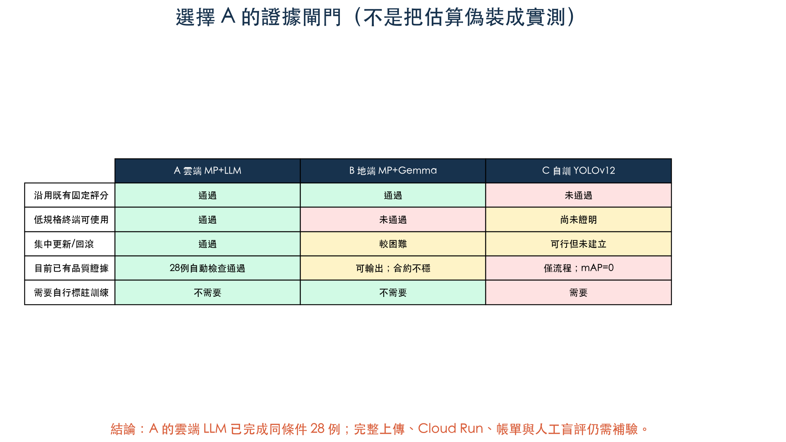
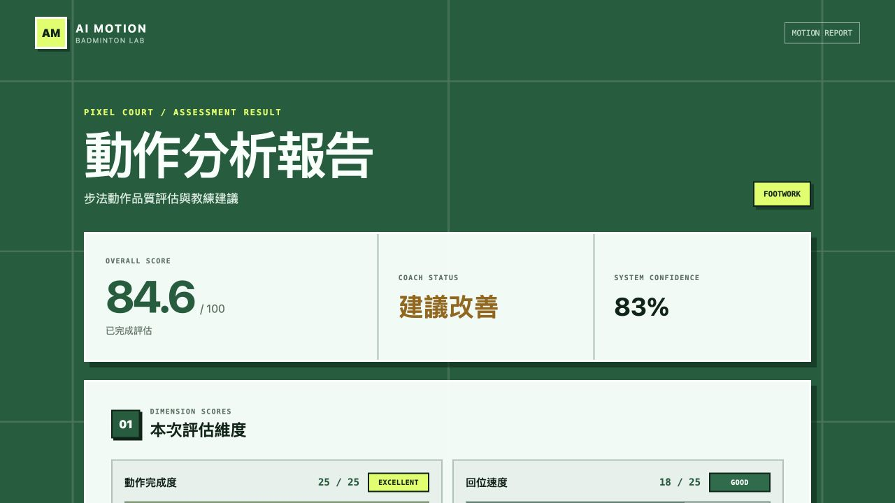
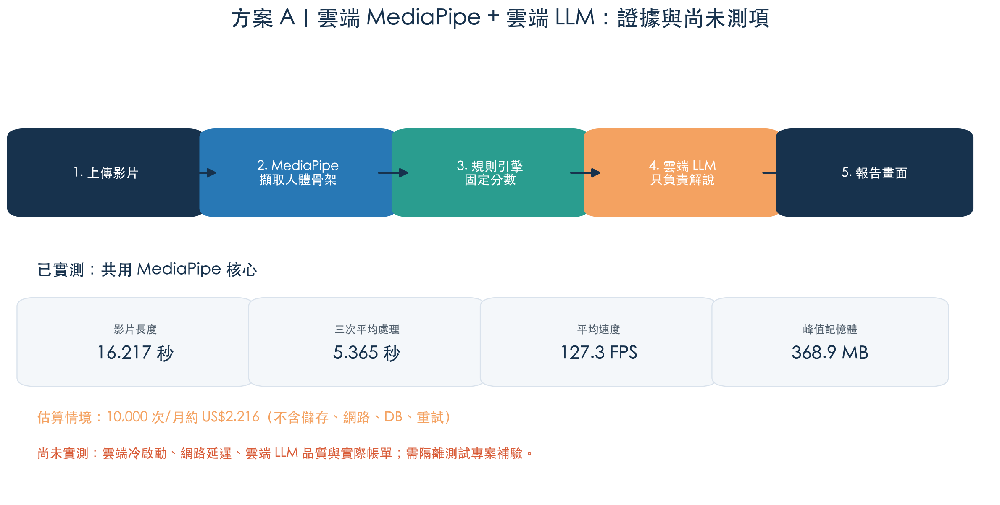
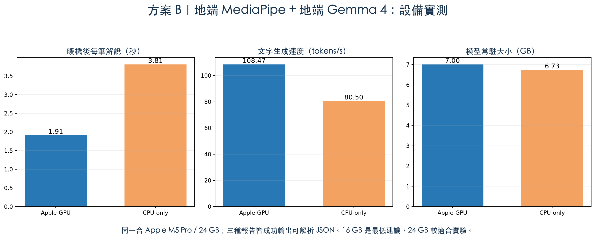
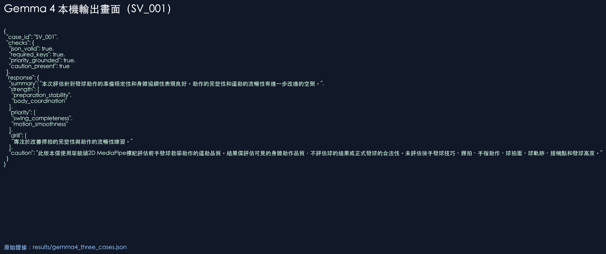
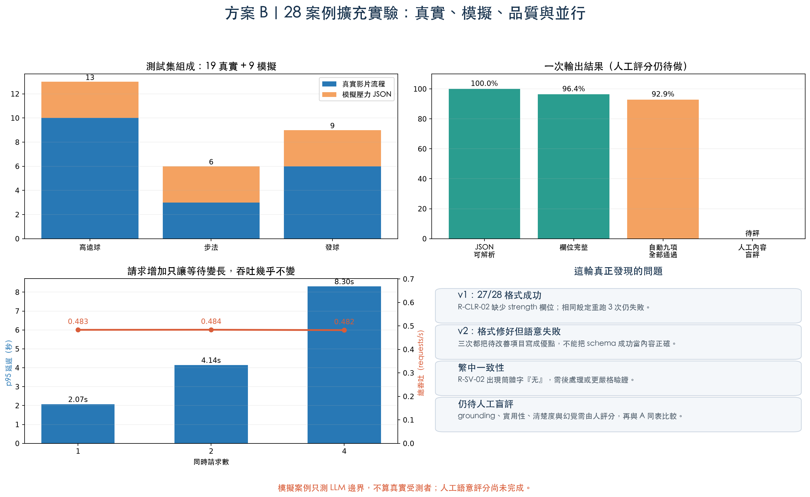
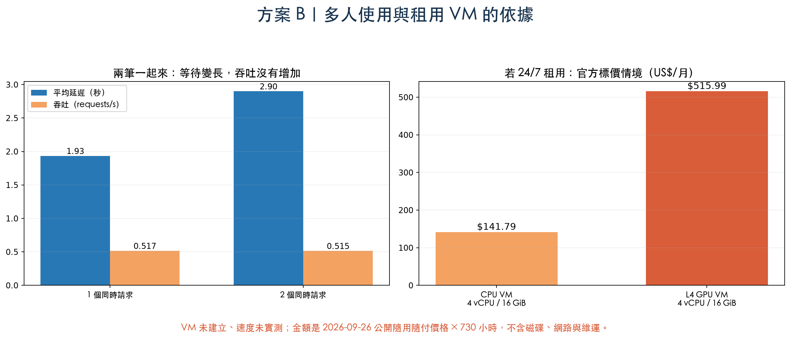
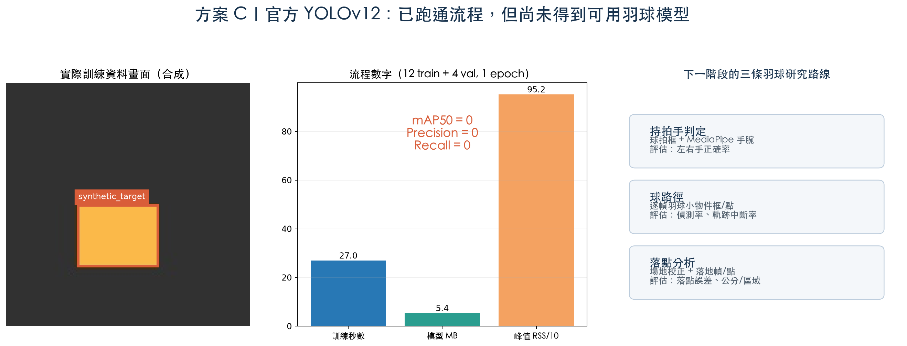
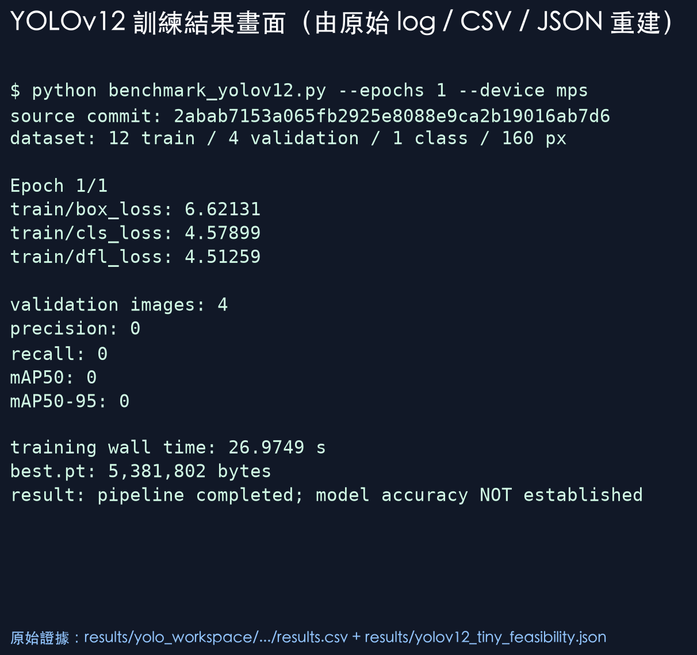

# A/B/C 羽球動作分析選型實驗報告

日期：2026-09-26

執行環境：Apple M5 Pro、24 GB 統一記憶體、macOS 26.5.2

結論：**目前選擇 A，但這是一個「附帶補驗條件」的工程選擇，不是宣稱 A 已完成雲端實測。**

## 1. 先用一句話理解三個方案

- **A 像中央廚房**：影片送到雲端，由同一套 MediaPipe、評分規則與雲端 LLM 統一處理；使用者裝置不用放大模型。
- **B 像每個人家裡各放一套廚房**：MediaPipe 與 Gemma 4 都在本機，資料不必送給 LLM 供應商，但每台機器都要有足夠硬體、模型與更新流程。
- **C 像自己培育一位專門的球探**：YOLOv12 要先看大量人工標註的羽球資料，才可能學會找球拍、羽球與落點；只有程式能訓練，不代表球探已經學會。

三案不是完全等價的替代品。A、B 沿用既有 MediaPipe 骨架與規則分數；C 是新的感知模型，較適合補足球拍、羽球與球路，而不是直接取代目前分數。

## 2. 這次怎麼判斷

選型的必要條件如下：

1. 必須保留目前可解釋、可版本化的 MediaPipe 與規則分數。
2. LLM 只能把結構化結果說成人話，不能改分數。
3. 一般使用者不能被要求下載 7 GB 模型或準備高階電腦。
4. 模型、提示詞與規則要能集中更新及回滾。
5. 「程式跑得動」與「模型準確」必須分開。
6. 所有數字必須標示為實測、估算或尚未測得。

## 3. 共同基準：MediaPipe 實際能跑多快

使用 PoC 本機既有 `serve` 影片 `ma_120f8334b8094f5f`：

| 項目 | 實測結果 |
|---|---:|
| 影片 | 1750 × 954、683 frames、16.217 秒 |
| 重跑次數 | 3 |
| 三次牆鐘時間 | 5.6885 / 5.4291 / 4.9778 秒 |
| 平均處理時間 | 5.3651 秒 |
| 即時倍率 | 0.3308（處理比影片播放快） |
| 平均處理速度 | 127.303 FPS |
| 峰值 RSS | 368.94 MB |
| 三次整體分數 | 87 / 87 / 87 |
| 三次系統信心 | 1.0 / 1.0 / 1.0 |

這代表：目前既有核心已能穩定把人體動作轉成固定分數。A 與 B 可以共用它，不需要讓 LLM「看影片猜分數」。原始證據是 [`results/mediapipe_serve_baseline.json`](results/mediapipe_serve_baseline.json)。

以下是 PoC 既有動作報告的實際畫面，可看到分數、能力拆解與教練建議如何呈現在使用者端：

MediaPipe 的邊界也很清楚：單鏡頭 2D 骨架適合身體關節、動作完整性與穩定度；它不直接知道羽球落在哪裡，也不可靠地辨識球拍面、擊球瞬間或高速羽球。

## 4. A：雲端 MediaPipe + 雲端 LLM

### A 的工作步驟

1. 使用者上傳影片。
2. 雲端服務執行 MediaPipe，取得人體骨架。
3. 既有規則引擎產生固定分數與證據。
4. 雲端 LLM 只讀結構化報告，產生摘要、優點、優先改善項目與練習。
5. 系統驗證 LLM JSON；失敗時仍可回傳固定規則報告。

### A 目前有哪些證據

- **實測**：相同 MediaPipe 核心處理 16.217 秒影片平均 5.3651 秒，三次分數一致。
- **估算**：用 B 實際平均 414.333 input tokens、199.333 output tokens，套入 2026-09-26 Gemini 2.5 Flash-Lite 公開單價（input US$0.10/1M、output US$0.40/1M）。
- **估算**：Cloud Run 以 1 vCPU、依本機峰值 RSS 換算 0.3603 GiB、執行 5.3651 秒，套入公開 CPU/RAM 單價。
- **情境結果**：LLM 約 US$0.00012117/次，運算約 US$0.00010044/次，合計約 US$0.00022160/次；10,000 次/月約 US$2.216。

這個 US$2.216 **不是雲端帳單預測**。它沒有包含 Storage、網路、資料庫、logging、重試、稅金，也假設雲端執行時間等於這台 Mac 的本機時間。它的用途只是讓各成本成分可計算。原始估算在 [`results/option_a_cost_estimate.json`](results/option_a_cost_estimate.json)，公式在 [`estimate_option_a.py`](estimate_option_a.py)。

### A 尚未測得

- 真正的上傳時間與網路延遲。
- Cloud Run 冷啟動、不同 CPU 的 MediaPipe 執行時間。
- 雲端 LLM 對同三筆輸入的延遲、JSON 成功率與內容品質。
- 真正的儲存、資料庫、監控與網路帳單。

因此本報告選 A 的理由是部署與維運結構最符合產品條件，不是因為已證明雲端 LLM 一定比 Gemma 4 準確。

## 5. B：地端 MediaPipe + 地端 Gemma 4

### B 做了什麼

Gemma 4 不看原始影片，只讀 MediaPipe 與規則引擎已產生的 JSON。提示詞禁止它改分數、聲稱看見球拍/羽球或做醫療診斷。

測試資料包含兩筆發球報告與一筆步法報告。GPU 模式每筆跑兩次，共 6 筆；CPU-only 模式共 3 筆。

| 項目 | Apple GPU 實測 | CPU-only 實測 |
|---|---:|---:|
| 模型 | `gemma4:e2b`, Q4_K_M | 同左 |
| 磁碟模型檔 | 7.162 GB | 同左 |
| Ollama 常駐大小 | 7.004 GB | 6.733 GB |
| 冷啟動首筆 | 5.3886 秒 | 7.2578 秒 |
| 暖機後平均 | 1.9091 秒 | 3.8094 秒 |
| 平均生成速度 | 108.469 tokens/s | 80.499 tokens/s |
| JSON 可解析率 | 100%（6/6） | 100%（3/3） |
| 必要欄位率 | 100% | 100% |
| 優先項目有根據 | 100% | 100% |

實際輸出畫面如下；完整內容在 [`results/gemma4_three_cases.json`](results/gemma4_three_cases.json) 與 [`results/gemma4_cpu_only.json`](results/gemma4_cpu_only.json)。

### B 的 28 案例擴充測試

為了讓 A、B 未來能使用完全相同的輸入，我對現有素材做 SHA-256 去重，建立 19 個真實「影片 × 動作」案例，再加入 9 個明確標示為非影片、不可算成真實受測者的模擬壓力案例。

- 真實：高遠球 10、步法 3、發球 6，19/19 產生報告。
- 模擬：三類動作各 3，測高低分、低信心、無分數、無改善項目等邊界。
- Gemma 一次輸出 28/28 有效 JSON，27/28 五個必要欄位完整。
- 真實案例 p50 2.0218 秒、p95 3.1906 秒；模擬案例 p50 1.3857 秒、p95 1.6554 秒。
- 自動九項檢查 26/28 全部通過；人工 grounding、實用性、清楚度與幻覺盲評尚未完成。

`R-CLR-02` 沒有任何規則引擎標記的優點。Gemma v1 把 `strength` 欄位名稱寫錯，相同設定重跑三次仍失敗。加入嚴格 JSON 範本後，v2 三次都補回欄位，卻三次都把待改善項目誤寫成優點。這是本輪最重要的品質發現：**格式正確不代表內容正確。**另一個案例 `R-SV-02` 出現簡體字「无」，顯示仍需要輸出驗證與後處理。

測試集規則與完整結果見 [A vs B 共用測試集說明](AB_BENCHMARK_CORPUS.zh-TW.md)。

初步把同一份報告以 1 個與 2 個同時請求送入暖機後的本機 Gemma，已看出總吞吐沒有增加。擴充為每級五批後，1、2、4 個同時請求的 p95 分別是 2.0710、4.1401、8.3004 秒，總吞吐分別是 0.4834、0.4838、0.4822 requests/s；35/35 成功，但幾乎是依序排隊。這顯示目前單 runner 不會因請求增加而提高產能。

完整設備判讀與 VM 條件見 [B 的設備、並行與 VM 專章](B_EQUIPMENT_AND_VM.zh-TW.md)。

### B 要什麼設備

這是根據「7 GB 常駐模型 + 作業系統 + MediaPipe 約 369 MB + 應用程式」做的工程建議，不是跨機型實測：

| 設備 | 判斷 | 能做到的程度 |
|---|---|---|
| 8 GB RAM | 不建議 | 模型本身已接近可用記憶體上限，容易交換記憶體、卡頓或與 MediaPipe 搶資源。 |
| 16 GB RAM | 最低建議 | 單使用者、一次一筆、短報告可行；不要同時跑多模型或重型工具。 |
| 24 GB RAM | 本次已驗證 | Apple M5 Pro 可同時完成 MediaPipe 與 Gemma 實驗，GPU 暖機後約 1.91 秒/筆。 |
| 32 GB 以上 | 開發/並行建議 | 適合保留更多餘裕、跑較大 context 或做低度並行；仍須實際壓測。 |

GPU 不是「能不能跑」的必要條件：CPU-only 也有 100% JSON 成功率。但在這台機器上，GPU 把暖機後平均等待從 3.81 秒降到 1.91 秒，約快 2 倍。

### B 是否需要租 VM

**單人 PoC 不需要。**目前 24 GB Mac 已跑通，租 VM 只會增加帳號、網路、映像、監控與費用。

只有下列情況值得評估 B-VM：沒有 16–24 GB 的可用本機、多人要遠端共用、需要排程批次處理，或要量測多請求並行。此時它其實已不再是純地端 B，而是「自己維運的雲端 Gemma」。

2026-09-26 官方公開價格情境：

| VM 情境 | 公開隨用隨付價格 | 連續 730 小時/月 |
|---|---:|---:|
| Taiwan `n2-standard-4`，4 vCPU / 16 GiB、CPU-only | US$0.194236/小時 | 約 US$141.79/月 |
| `g2-standard-4`，1×L4 / 4 vCPU / 16 GiB | US$0.706832276/小時 | 約 US$515.99/月 |

以上沒有建立 VM，也沒有量測這些 VM 的 tokens/s；只是官方標價乘以時間。CPU VM 雖然記憶體放得下，速度不能直接用 M5 Pro 數字推論。GPU VM 理論上放得下 7 GB 模型，但並行量仍要測 KV cache、context 與排隊。

### B 為何不是目前首選

B 的功能已被證明可行，但 28 案例也顯示它需要 schema 驗證、語意 guardrail、繁中檢查與排隊管理。每個執行端仍要下載 7.2 GB、保留至少約 7 GB 模型常駐空間、管理 Ollama/模型版本，並承擔硬體差異。若改租 VM，成本與維運又回到雲端，卻失去直接使用託管 LLM 的彈性。

## 6. C：自行訓練 YOLOv12

### 本輪真的做了什麼

- 來源：YOLOv12 作者官方 `https://github.com/sunsmarterjie/yolov12.git`。
- 固定提交：`2abab7153a065fb2925e8088e9ca2b19016ab7d6`。
- 隔離 Python 3.11.16 環境；Apple MPS；官方程式內建的非 CUDA attention fallback。
- 產生 12 張訓練、4 張驗證的 160×160 合成方塊圖，單一類別。
- 從頭訓練 YOLOv12n 1 epoch，再驗證並做 5 次暖機後推論。

| 項目 | 實測結果 |
|---|---:|
| 訓練時間 | 26.9749 秒 |
| 峰值程序 RSS | 952.28 MB |
| `best.pt` | 5,381,802 bytes（約 5.38 MB） |
| 暖機後單張推論 | 平均 0.005915 秒 |
| mAP50 / mAP50-95 | 0 / 0 |
| precision / recall | 0 / 0 |
| 五次預測數量 | 0 / 0 / 0 / 0 / 0 |

原始證據在 [`results/yolov12_tiny_feasibility.json`](results/yolov12_tiny_feasibility.json)。這只能證明官方程式在此 Mac 可完成「資料 → 訓練 → 驗證 → 推論」；零指標代表模型尚未學會，不能宣稱準確。

### C 真正適合研究什麼

1. **持拍手判定**：YOLO 找球拍，再把球拍位置與 MediaPipe 左/右手腕配對。
2. **羽球路徑**：YOLO 找每一幀的羽球，再用 tracker/Kalman/時間規則連成軌跡。
3. **落點分析**：球路徑之外還要做球場座標校正、辨識落地時間，再把影像座標轉成球場公分或區域。

詳細資料量、標註欄位、切分方式與驗證指標見 [C 的羽球訓練研究計畫](C_RESEARCH_PLAN.zh-TW.md)。

### C 為何不是目前首選

C 還沒有真實羽球標註資料與可用精度，而且即使成功，它解決的是「看見球拍/羽球/落點」，不會自然產生既有的骨架角度、動作規則與教學分數。它是值得做的後續增強研究，不是這一版 A/B 文字解說方案的直接替代品。

## 7. 最後為什麼選 A

證據鏈不是「A 比所有模型都準」，而是：

1. 已有 MediaPipe + 規則核心重跑穩定，A 可以直接沿用。
2. LLM 被限制為解說層，所以換雲端 LLM 不會破壞分數真實來源。
3. B 已證明能做，但每台機器需要約 7 GB 常駐模型與至少 16 GB RAM；這不適合一般終端部署。
4. B 若租 24/7 VM，CPU 參考情境約 US$141.79/月，L4 參考情境約 US$515.99/月，且還要自己維運模型。
5. C 的工程流程已通，但品質指標為 0；要進入羽球功能仍需真實標註、訓練與場地/時間邏輯。
6. A 把重運算、版本、提示詞與回滾集中在服務端，一般終端只需上傳和看報告；依目前產品條件最合理。

所以正式說法應是：

> 本輪選擇 A，因為它能沿用已驗證的 MediaPipe 固定評分，又不把 7 GB 本機模型與硬體門檻轉嫁給使用者；C 則尚處於資料與模型研究階段。A 的雲端端到端延遲、LLM 品質與實際成本仍需在完全隔離的測試專案補驗，補驗通過後才可成為正式部署決策。

## 8. 證據可信度與限制

- 只實測一台 Apple M5 Pro / 24 GB，不能代表所有 Mac、Windows、Linux 或 VM。
- B 的 GPU 與 CPU 輸出 token 數不同，因此延遲與 tokens/s應一起看。
- B 的 28 案例已完成自動 contract/grounding 檢查，但人工教練品質盲評仍待 A 產生相同輸出後執行。
- A 沒有雲端實測；成本是透明公式情境，不是報價或帳單。
- C 只有 16 張合成圖片與 1 epoch，特意只驗流程，不驗準確度。
- 沒有建立任何雲端 VM、Cloud Run、Cloud SQL、bucket、queue、secret 或 service account，也沒有接觸羽球＋1正式資源。

## 9. 公開來源

- [YOLOv12 作者官方實作](https://github.com/sunsmarterjie/yolov12)
- [YOLOv12 論文與官方程式連結（NeurIPS 2025）](https://proceedings.neurips.cc/paper_files/paper/2025/hash/7103444259031cc58051f8c9a4868533-Abstract-Conference.html)
- [Gemini Developer API pricing](https://ai.google.dev/gemini-api/docs/pricing)
- [Google Cloud Run pricing](https://cloud.google.com/run/pricing)
- [Google Cloud general-purpose VM pricing](https://cloud.google.com/products/compute/pricing/general-purpose)
- [Google Cloud accelerator-optimized VM pricing](https://cloud.google.com/products/compute/pricing/accelerator-optimized)
